# PyQtSamples
Some examples written in PyQt, the Python binding for the Qt application framework.

Each example is voluntarily minimalist and simple as possible. Their purpose is only to illustrate the use of an aspect of PyQt.
In fact it's more like code templates, intended to be reused **and completed** (for example because of lack of errors checking). Regularly when I develop and need a PyQt feature, I use these samples as code I can copy/paste to save time. 

It's very usefull so I hope this repository will help some people :)

# Minimal Requirements
- **Python 3.5** (personnaly I use the 3.5.2 version)
- **PyQt 5.7** (some samples need also **PyQtChart** and/or **PyQtDataVisualization** and/or **PyQtPurchasing**)
- **numpy** (required in few examples)
- **Qt Creator** (to open .pro projects and execute them)

## How to install them
You can download **Python** from the [official site](https://www.python.org/downloads/) and install it.

When the installation is done, we need to install the package **pip** and use it to install **PyQt** and some submodules.
To do this, open a console and write:
```
cd C:\Python35
python -m pip install --upgrade pip
cd C:\Python35\Scripts
pip3 install pyqt5
pip3 install PyQtChat
pip3 install PyQtPurchasing
pip3 install PyQtDataVisualization
``` 

To execute some examples (like OpenGL ones), the **Numpy** package is required. To install it, as above, write this:

```
pip3 install numpy
```

Finally you can download **Qt Creator** from [here](https://www.qt.io/download-open-source/#section-2) and install it.

# How To Run Examples
In this repository, each subfolder represents a standalone project and you can open the corresponding .pro with Qt Creator. Then to be able to run the example, you must set the project as follow:

## Build Settings
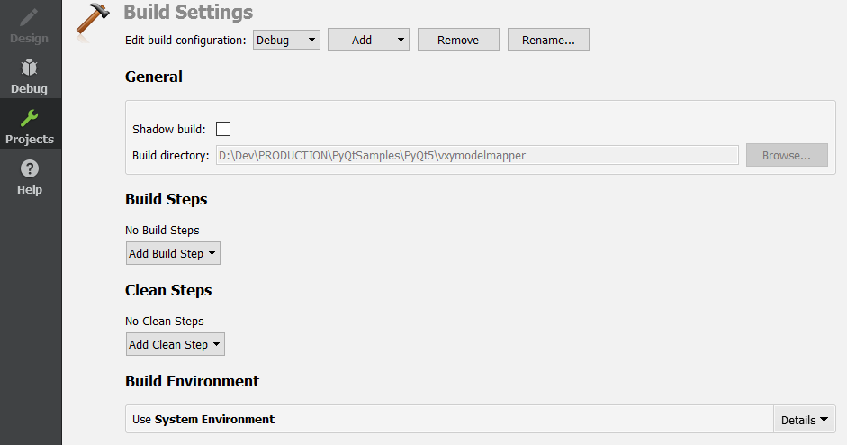
## Run Settings
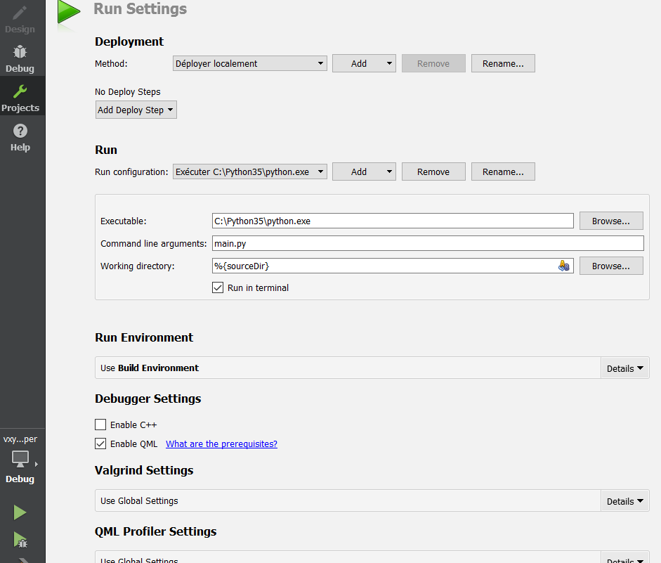

# Examples
## [QML Painted Item](PyQt5/qml_painted_item/)
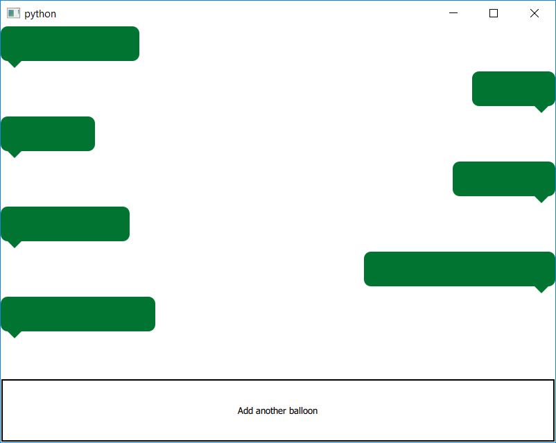
The Painted Item example shows how to use the QML Scene Graph framework to implement custom scenegraph items using QPainter.
<br><br>

## [VXYModelMapper](PyQt5/vxymodelmapper/)
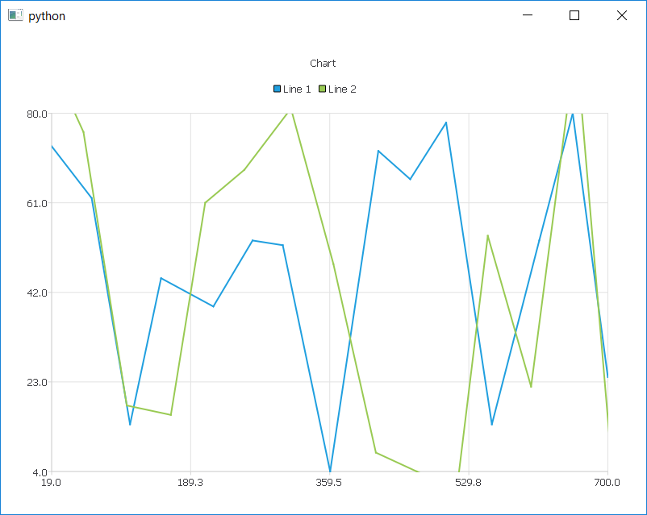
This QML example shows how to use a VXYModelMapper, to bind a QAbstractTableModel (python side) with a LineSeries (QML side).
<br><br>

## [HXYModelMapper](PyQt5/hxymodelmapper/)

This QML example shows how to use a HXYModelMapper, to bind a QAbstractTableModel (python side) with a LineSeries (QML side).
<br><br>

## [VBarModelMapper](PyQt5/vbarmodelmapper/)
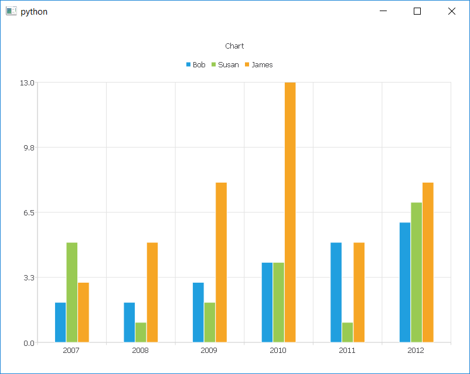
This QML example shows how to use a VBarModelMapper, to bind a QAbstractTableModel (python side) with a BarSeries (QML side).
<br><br>

## [HBarModelMapper](PyQt5/hbarmodelmapper/)

This QML example shows how to use a HBarModelMapper, to bind a QAbstractTableModel (python side) with a BarSeries (QML side).
<br><br>

## [VPieModelMapper](PyQt5/vpiemodelmapper/)
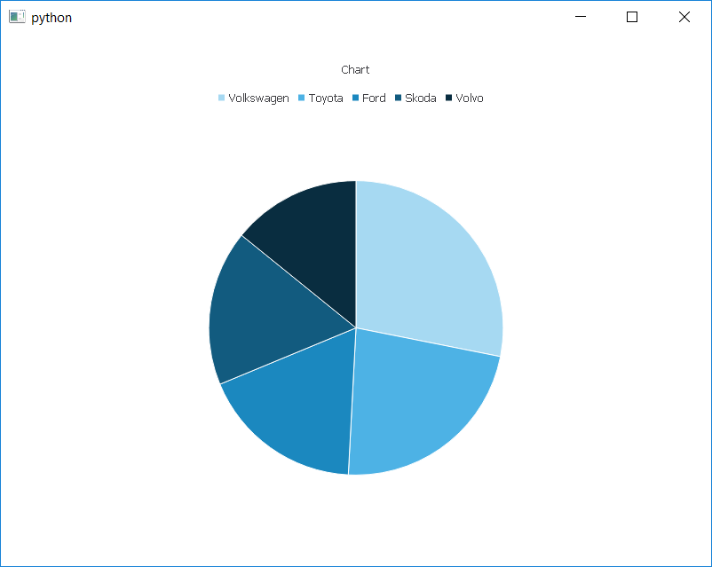
This QML example shows how to use a VPieModelMapper, to bind a QAbstractTableModel (python side) with a PieSeries (QML side).
<br><br>

## [HPieModelMapper](PyQt5/hpiemodelmapper/)

This QML example shows how to use a HPieModelMapper, to bind a QAbstractTableModel (python side) with a PieSeries (QML side).
<br><br>

## [VBoxPlotModelMapper](PyQt5/vboxplotmodelmapper/)
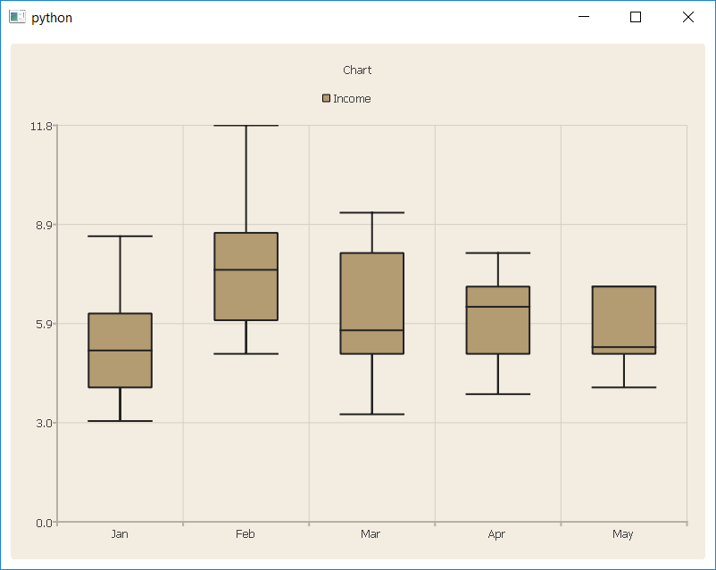
This QML example shows how to use a VBoxPlotModelMapper, to bind a QAbstractTableModel (python side) with a BoxPlotSeries (QML side).
<br><br>

## [DonutChartBreakdown](PyQt5/donut_chart_breakdown/)
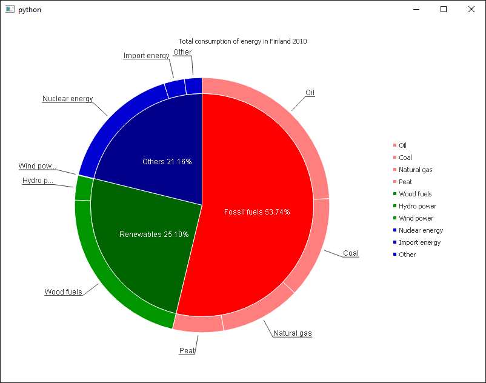
This QML example shows how to generate a donut chart, thanks to multiple PieSeries in a ChartView.
<br><br>

## [Triangle Simple](PyQt5/opengl/triangle_simple/)
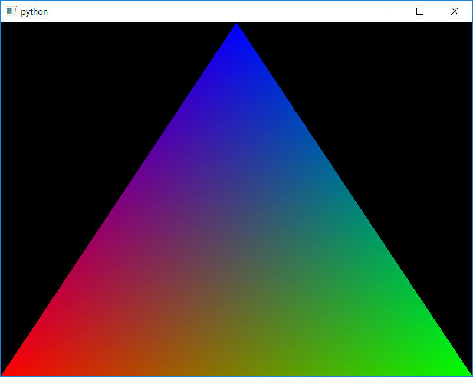
Renders a colored triangle in a QOpenGLWindow, using a QOpenGLVertexArrayObject.
<br><br>

## [Textured Quad](PyQt5/opengl/textured_quad/)
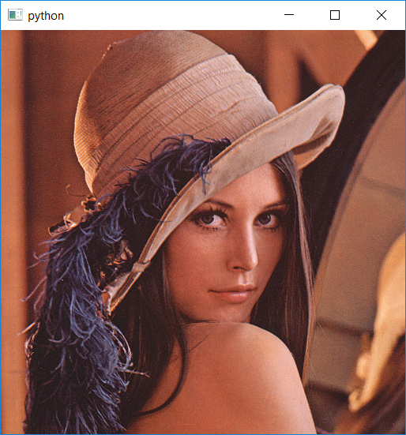
Renders a textured quad in a QOpenGLWindow, using a QOpenGLTexture.
<br><br>

## [Time Monitor Overlay](PyQt5/opengl/time_monitor_overlay/)
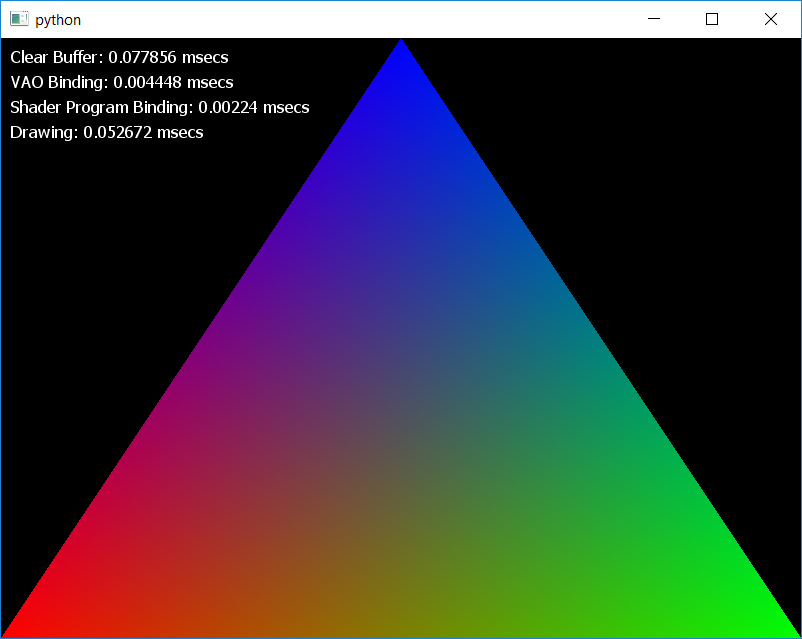
Show how to use a QOpenGLTimeMonitor object. In addition, this example shows how to render a 2D text overlay on top of an existing OpenGL scene. Here we display the QOpenGLTimeMonitor output.
<br><br>

## [QOffscreenSurface](PyQt5/opengl/qoffscreensurface/)
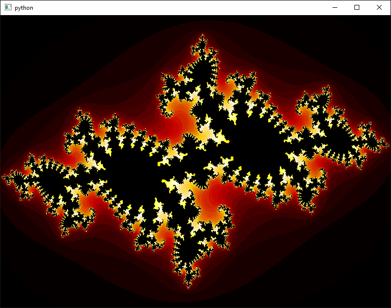
This sample shows how to use a QOffscreenSurface. We use also a QOpenGLWindow to display result of the QOffscreenSurface rendering.
Here we have only one thread and two shared QOpenGLContext.
<br><br>

## [FBO Texture](PyQt5/opengl/fbo_texture/)

Renders a textured quad with an offscreen pass (using QOpenGLFramebufferObject). With a mouse click we display the framebuffer content.
<br><br>

# Licenses
MIT
